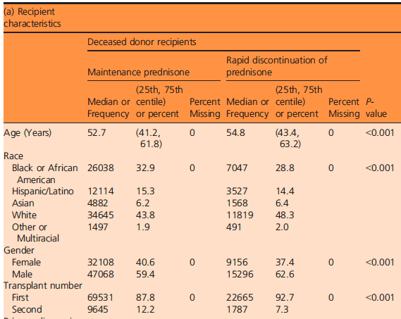

```{r setup, include=FALSE}
knitr::opts_chunk$set(echo = TRUE)
source("Rexample_TableOne_SMD_library.R")
set.seed(1234)
def.chunk.hook  <- knitr::knit_hooks$get("chunk")
knitr::knit_hooks$set(chunk = function(x, options) {
  x <- def.chunk.hook(x, options)
  ifelse(options$size != "normalsize", paste0("\\", options$size,"\n\n", x, "\n\n \\normalsize"), x)
})

data(GerberGreenImai)
imai <- GerberGreenImai

imai <- mutate(imai,
  VOTE96.1F = factor(VOTE96.1, labels = c("No", "Yes")),
  VOTED98F = factor(VOTED98, labels = c("No", "Yes")),
  NEWF = factor(NEW, labels = c("Previous Voter", "New Voter")),
  MAJORPTYF = factor(MAJORPTY, labels = c("Republican", "Democrat")),
  PERSONSF = factor(PERSONS, labels = c("1 Voter", "2+ Voters")),
  PHN.C1F = factor(PHN.C1, labels = c("Not Contacted", "Contacted")))
imai <- set_variable_labels(imai,
	VOTED98F = "Voted in 1998",
  PHN.C1F = "Contacted by phone", 
  PERSONSF = "Voters in household", 
  WARD = "Ward of residence", 
  AGE = "Age (years)", 
  MAJORPTYF = "Party affilation", 
  VOTE96.1F = "Voted in 1996", 
  NEWF = "New voter" 
)

p1 <- mean(imai$VOTED98[imai$PHN.C1 == 1])
p0 <- mean(imai$VOTED98[imai$PHN.C1 == 0])
n1 <- table(imai$PHN.C1)[2]
n0 <- table(imai$PHN.C1)[1]
#print("Unadjusted ATE")
ATE_unadj <- p1 -  p0
#print(ATE_unadj, digits = 3)
#print("Standard Error")
SE <- sqrt(p1*(1-p1)/n1 + p0*(1-p0)/n0)
#print(SE, digits = 3)
#print("95% CI")
CI_unadj <- p1 - p0 + c(-1, 1)*qnorm(0.975)*SE
#print(p1 - p0 + c(-1, 1)*qnorm(0.975)*SE, digits = 3)

vars <- c("VOTED98F", "PERSONSF", "AGE", "VOTE96.1F", 
  "NEWF", "MAJORPTYF",  "WARD")
tabUnmatched <- CreateTableOne(vars = vars, strata = "PHN.C1F",
  data = imai, test = FALSE)
t1 <- print(tabUnmatched, smd = TRUE, showAllLevels = TRUE, varLabels = TRUE)


mod_match <- matchit(PHN.C1 ~ PERSONSF + VOTE96.1F + NEWF + 
		MAJORPTYF + AGE, distance = "logit",
	method = "nearest", data = imai, exact = c("WARD"), 
	ratio = 1)
print(tail(mod_match$match.matrix))

imai_match <- data.frame(rbind(imai[imai$PHN.C1 == 1, ],
	imai[as.numeric(mod_match$match.matrix), ]))
tabmatched1.1 <- CreateTableOne(vars = vars, strata = "PHN.C1",
	data = imai_match, test = FALSE)
t2 <- print(tabmatched1.1, smd = TRUE, showAllLevels = TRUE, 
						varLabels = TRUE)

mod_match <- matchit(PHN.C1 ~ PERSONSF + VOTE96.1F + NEWF + 
		MAJORPTYF + AGE, distance = "logit",
	method = "nearest", data = imai, exact = c("WARD"), 
	ratio = 4)
print(tail(mod_match$match.matrix))

imai_match <- data.frame(rbind(imai[imai$PHN.C1 == 1, ],
	imai[as.numeric(mod_match$match.matrix), ]))
tabmatched4.1 <- CreateTableOne(vars = vars, strata = "PHN.C1",
	data = imai_match, test = FALSE)

mod_match <- matchit(PHN.C1 ~ PERSONSF + VOTE96.1F + NEWF + 
		MAJORPTYF + AGE, distance = "logit",
	method = "nearest", data = imai, exact = c("WARD"), 
	ratio = 10)
print(tail(mod_match$match.matrix))

imai_match <- data.frame(rbind(imai[imai$PHN.C1 == 1, ],
	imai[as.numeric(mod_match$match.matrix), ]))
tabmatched10.1 <- CreateTableOne(vars = vars, strata = "PHN.C1",
	data = imai_match, test = FALSE)
t4 <- print(tabmatched10.1, smd = TRUE, showAllLevels = TRUE, 
						varLabels = TRUE)
```

## Key Idea
- Emphasis on summarizing data (both in graphical and tabular formats)
- Frequently instructors do not do a sufficient job explaining relevant summary measures for a particular analysis 
- Want some tabular and graphical summaries of potential confounders

## Observational Studies

- Observational study: Individuals are not assigned to treatment intervention by an experimental design
- Often unethical or impractical to do randomized trial
-  In general, $A$ is not independent of $\{Y^1, Y^0 \}$
-  Thus, the distribution of $Y|A = 1$ or $Y^1|A = 1$ does not equal the distribution of $Y^1$ and similarly the distribution of $Y|A = 0$ does not equal the distribution of $Y^0$
- Why? Confounding 
- Heuristically, those who receive treatment may be inherently different than those who do not. Consequently, the associational parameters may reflect such inherent differences as well as any effect of treatment
- In other words, there are common causes of both $Y$ and $A$

## Potential Confounders

- IF the treatment was randomly assigned, then the disribution of any baseline (i.e., pre-randomization) covariate should be the same in each level of the treatment
- Covariates which are related to (i.e., causes of) treatment will be differentially distributed between different levels of the treatment
- Want ways of summarizing the distribution of covariates between treatment levels
- Such a table is often referred to as Table 1 

## Example of Table 1



## TableOne 

- TableOne is an R package created by Kazuki Yoshida that eases the construction of “Table 1”, i.e., patient baseline characteristics table commonly found in biomedical research papers. 
- This package is also very helpful in providing an overview of your data since it can summarize both continuous and categorical variables mixed within one table. 


```{r, size="tiny"}
CreateTableOne(data=iris)
```
}

## Some relevant information sources

https://cran.r-project.org/web/packages/tableone/index.html

https://cran.r-project.org/web/packages/tableone/vignettes/introduction.html

https://cran.r-project.org/web/packages/tableone/vignettes/smd.html

http://rstudio-pubs-static.s3.amazonaws.com/13321_da314633db924dc78986a850813a50d5.html


## A New Categorical Variable 
Let's add in a new column for color (0 for white, 1 for red) and make the table again:
```{r, size = "tiny"}
new.iris <- cbind(iris, Petal.Color=rbinom(n=150, size=1, prob=0.5))
CreateTableOne(data=new.iris)
```
We can see that in this case, the package is unable to determine that Petal.Color is a categorical variable. We will have to set this manually. 


## Continuous vs Categorical Variables
We can specify which variables we would like in the table, and which variables should be considered categorical:
```{r, size = "tiny"}
all.vars <- c("Petal.Length", "Petal.Width", "Species", "Petal.Color")
cat.vars <- c("Species", "Petal.Color")
CreateTableOne(vars=all.vars, data=new.iris, factorVars=cat.vars)
```
Notice that Petal.Color only shows one level here. 


## Print Option 1: Show all levels 
The default when a categorical variable has 2 levels is to only show one of the levels. To show all the levels for the categorical variables:
```{r, size = "tiny"}
t1 <- CreateTableOne(vars=all.vars, data=new.iris, factorVars=cat.vars)
print(t1, showAllLevels = TRUE)
```

## Resetting Levels for Categorical Variables
Instead of showing 0/1 for Petal.Color, we can also reset the level for this variable so it displays as "White"/"Red": 
```{r, size = "tiny"}
new.iris$Petal.Color <- as.factor(new.iris$Petal.Color)
levels(new.iris$Petal.Color) <- c("White", "Red")
t1 <- CreateTableOne(vars=all.vars, data=new.iris)
print(t1, showAllLevels = TRUE)
```
Notice that if the levels are changed to character values, R will automatically change this variable into a "factor", you won't need to manually set it as a categorical variable. 

## Print Option 2: Interquartile Range 
For nonnormal (skewed) continuous variables, the interquartile range (IQR) can be displayed instead of the mean and standard deviation:
```{r, size = "tiny"}
nn.vars <- c("Sepal.Length", "Sepal.Width")
t2 <- CreateTableOne(data=iris)
print(t2, nonnormal = nn.vars)
```


## Checking Missingness
The TableOne package can also help you check for missingness in your data. Here we set the first 10 Petal.Length values to NA and check for missingness:
```{r, size = "tiny"}
na.iris <- iris; na.iris$Petal.Length[1:10] <- rep(NA, 10)
t3 <- CreateTableOne(data=na.iris)
summary(t3)
```

## Stratify by Group and Testing 
Often times you want to see summaries of different strata, with the strata usually being the treatment variable. Going back to our Petal.Color example: 
```{r, size = "tiny"}
CreateTableOne(data = new.iris, strata = "Petal.Color")
```
Note the group comparison p-value that are printed in the table. The hypothesis test functions used by default are chisq.test() for categorical variables (with continuity correction) and oneway.test() for continuous variables (with equal variance assumption, i.e., regular ANOVA). Two-group ANOVA is equivalent of t-test.


## Print Option 3: Standardized Mean Differences 
The Standardized Mean Difference (SMD), also known as Cohen's D, is a measure of distance between two group means in terms of one or more variables. In practice it is often used as a balance measure of individual covariates before and after propensity score matching. (More on this later in the semester...) Using our example from the previous slide:
```{r, size = "tiny"}
t3 <- CreateTableOne(data = new.iris, strata = "Petal.Color")
print(t3, smd = TRUE)
```

## Print Option 4: Variable Name Labels
Using the "labelled" package, a label can be assigned to each variable and displayed in the final printed table. This way, your variable names stay intact for further manipulations in your code but your tableone output will be presentation quality:
```{r, size = "tiny"}
new.iris <- set_variable_labels(new.iris, 
                                Sepal.Length = "Length of Sepal", 
                                Sepal.Width = "Width of Sepal", 
                                Petal.Length = "Length of Petal", 
                                Petal.Width = "Width of Petal", 
                                Petal.Color = "Color of Petal"
)
print(CreateTableOne(data=new.iris), varLabels = TRUE)
```


## Export to LATEX/CSV
In my opinion, a huge advantage of using the tableone package is how easily this R table can be exported. To turn this table into LATEX code, we use the "xtable" package here:
```{r, eval=FALSE, size = "tiny"}
final.table <- print(CreateTableOne(data=new.iris), varLabels = TRUE)
print(xtable(final.table))
```
You can just as easily export this table to a CSV format (for Excel):
```{r, eval=FALSE, size = "tiny"}
write.csv(final.table, file = "myTable.csv")
```

## Plot of SMD

- If we have a lot of baseline covriates it is helpful to plot the absolute value of the standardized mean difference
- We will discuss methods in the future (e.g., weighting, matching, etc.) which help reduce the imbalance (i.e., absolute SMD) among groups. Plotting those on the same plot can show how we "fixed" the imbalance. 
- Example given on the following slide of the SMD in the "original" dataset and then under various matching and weighting methods

## Plot of SMD

```{r, echo = FALSE, size="tiny", results = "hide"}
p1 <- glm(PHN.C1 ~ (PERSONS + VOTE96.1 + NEW + MAJORPTY + 
		AGE + WARD), data = imai, family = "binomial")
ps <- predict(p1, type = "response")
imai$weight <- imai$PHN.C1 + (1-imai$PHN.C1)/(1-ps)*ps
imaiSvy <- svydesign(ids = ~ 1, data = imai, weights = ~ weight)
tabWeighted <- svyCreateTableOne(vars = vars, strata = "PHN.C1F",
  data = imaiSvy, test = FALSE)
dataPlot <- data.frame(variable  = rownames(ExtractSmd(tabUnmatched)),
	Unweighted = as.numeric(ExtractSmd(tabUnmatched)),
	Weighted_logit  = as.numeric(ExtractSmd(tabWeighted)),
	Matched1_1 = as.numeric(ExtractSmd(tabmatched1.1)),
	Matched4_1 = as.numeric(ExtractSmd(tabmatched4.1)),
	Matched10_1 = as.numeric(ExtractSmd(tabmatched10.1)))
dataPlot <- dplyr::filter(dataPlot, 
                          variable != "VOTED98F")

## Create long-format data for ggplot2
dataPlotMelt <- melt(data          = dataPlot,
	id.vars       = c("variable"),
	variable.name = "Method",
	value.name    = "SMD")

## Order variable names by magnitude of SMD
varNames <- as.character(dataPlot$variable)[order(dataPlot$Unweighted)]

## Order factor levels in the same order
dataPlotMelt$variable <- factor(dataPlotMelt$variable,
	levels = varNames)

## Plot using ggplot2
ggplot(data = dataPlotMelt,
	mapping = aes(x = variable, y = SMD, group = Method, color = Method)) +
	geom_line() +
	geom_point() +
	geom_hline(yintercept = 0.1, color = "black", size = 0.1) +
	coord_flip() +
	theme_bw() + theme(legend.key = element_blank())
```

## Other plots

- Can be useful to assess overlap in the distribution of covariates; will introduce later in the context of matching, weighting
- Should also graphically assess covariate outcome relationships; more on that in regression adjustment

## Practice
Load the following dataset from the Mayo Clinic trial in primary biliary cirrhosis of the liver:
```{r, eval=FALSE}
library(survival)
data(pbc)
```
Try answering the following questions using the pbc dataset:

- How many male patients are there in the dataset, and what is the percentage?
- Turn c("status", "trt", "ascites", "hepato","spiders", "edema", "stage") into categorical variables and show all levels. What percent of patients are stage 3?
- How many missing values are there for "copper" and "stage"? What percent of values are missing for "trig"?
- Display the IQR for c("bili","chol","copper","alk.phos","ast","trig","protime"). What is the median for "chol"? What is the 25th percentile value for "ast"?
- Stratify the summary data by "trt". Is there a significant difference in means for age between the two treatments? What is the SMD for "platelet"?

