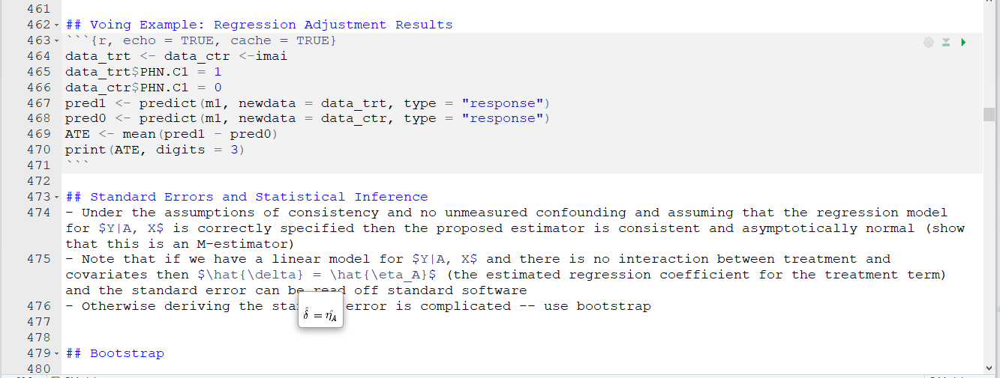

```{r setup, include=FALSE}
knitr::opts_chunk$set(echo = FALSE)
def.chunk.hook  <- knitr::knit_hooks$get("chunk")
knitr::knit_hooks$set(chunk = function(x, options) {
  x <- def.chunk.hook(x, options)
  ifelse(options$size != "normalsize", paste0("\\", options$size,"\n\n", x, "\n\n \\normalsize"), x)
})
source("Lecture_regression_adjustment_library.R")
```

## Observational Studies

- Observational study: Individuals are not assigned to treatment intervention by an experimental design
- Often unethical or impractical to do randomized trial
-  In general, $A$ is not independent of $\{Y^1, Y^0 \}$
-  Thus, the distribution of $Y|A = 1$ or $Y^1|A = 1$ does not equal the distribution of $Y^1$ and similarly the distribution of $Y|A = 0$ does not equal the distribution of $Y^0$
- Why? Confounding 
- Heuristically, those who receive treatment may be inherently different than those who do not. Consequently, the associational parameters may reflect such inherent differences as well as any effect of treatment
- In other words, there are common causes of both $Y$ and $A$


## Original Population

```{r, echo = FALSE, cache = TRUE}
set.seed(1101985)
n <- 10000
gamma <- 1
alpha <- 2
X <- rnorm(n, 0, 1)
Y1 <- rnorm(n, gamma*X + 4, 1)
Y0 <- rnorm(n, gamma*X, 1)
hist(Y1)
```

## Identify 200 Participants for Study

```{r, echo = FALSE, cache = TRUE}
set.seed(110985)
sample.use.large <- sample(1:10000, 500, replace = FALSE)
hist(Y1[sample.use.large])
```

## Nonrandom Assignment of Treatment (only observe $Y^1$ on these participants)


```{r, echo = FALSE, cache = TRUE}
sample.use.large.A1 <-sample.use.large[which(rbinom(n, 1, 
  exp(alpha*X[sample.use.large])/(1+exp(alpha*X[sample.use.large]))) == 1)]
hist(Y1[sample.use.large.A1])
```

## Challenge of Observational Studies
- Key challenge of observational studies - patients receiving treatment 1 may not be prognostically similar to those receiving treatment 0
- In potential outcome notation $\{Y^1, Y^0 \}$ are not independent of $A$
- Note that this was the key assumption which allowed us to use sample averages to estimate $E(Y^1)$ and $E(Y^0)$ consistently


## No Unmeasured Confounders
- If we can identify all the pretreatment variables which are believed to explain part of the prognostic variation AND treatment choice, then it may be reasonable to assume that treatment assignment is otherwise random. 
- That is $\{Y^1, Y^0\}$ are independent of $A$ conditioned on $X$. In other words within levels of a covariate it is as if we did a randomized study
- Known as the strong ignorability assumption or no unmeasured confounders
- Unidentifiable assumption


## A note on No Unmeasured Confounders
- If the treatment/intervention/action/exposure is selected by natural choice, then at some level the no unmeasured confounders assumption must be true.
- When a physician is deciding which treatment to give a patient, clearly she does not know what the potential outcomes of the patient are.
- Therefore, if all the relevant information that may affect treatment decisions were captured in the data $X$ , then the no unmeasured confounders assumption would be tenable.
- Problem is that if there is some information that affects treatment choice (and outcome) which is not captured in the data $X$ available to the analyst. 


## Regression Estimator
- We will argue that under the assumptions of consistency and no unmeasured confounding
$E\{E(Y|A=1, X) - E(Y|A=0, X)\} = E(Y^1 - Y^0)$
- Note the first expectation is over the distribution of $X$
- This says that I can find the treatment effect within each level of the covariate $X$ and then weight the treatment effect within each level of the covariate by the frequency of each level of $X$ 

## Regression Estimator
- Assume that $X$ is binary (say young versus old)
- Our assumption is that within each level of $X$ it is as if a randomized trial were done. 
- Can find the ATE in young by taking difference in sample average between treatment and control in this stratum (similar for old)
- Overall ATE would be a weighted average of ATE in young and ATE in old

## Regression Modeling
- $X$ may be continuous and involve many different covariates $\rightarrow$ modeling 
- If we can develop "good" estimators for the distribution of $Y|A=1, X$ & $Y|A=0, X$ and for the distribution of $X$ then we can get  a "good" estimator of $E(Y^1)$ and $E(Y^0)$
- We are really good at specifying models for $Y|A, X$ - these are regression models
- For example, if $Y$ is continuous a natural model might be $E(Y, A, X) = \mu(A, X; \eta) = \eta_0 + \eta_1^TX + \eta_2A + \eta_3^TAX$ and we could estimate $\eta$ using least squares (call this $\hat{\eta}$)
- We can estimate the distribution of $X$ nonparametrically using the empirical distribution

## Regression Modeling
- Putting it all together
1) $\hat{E}(Y^1) = \tfrac{1}{n} \sum_{i = 1} \mu(1, X_i; \hat{\eta})$
2) $\hat{E}(Y^0) = \tfrac{1}{n} \sum_{i = 1} \mu(0, X_i; \hat{\eta})$
3) $\hat{\delta} = \hat{E}(Y^1) - \hat{E}(Y^0)$ 

## Regression Modeling
- Putting it all together in words
a) Posit some model for $E(Y, A, X) = \mu(A, X; \eta)$ and get parameter estimates for $\eta$ using least squares or MLEs. 
b) Get the predicted value for each subject in the data set assuming that they were treated and untreated. That is, compute $\mu(1, X_i; \hat{\eta})$ and $\mu(0, X_i; \hat{\eta})$ for each $i$
c) Take the average of $\mu(1, X_i; \hat{\eta})$ and $\mu(0, X_i; \hat{\eta})$. This gives an estimate of $\hat{E}(Y^1)$ and $\hat{E}(Y^0)$, respectively.
d) Take their difference

## Regression Modeling
- The preceding approach works regardless of whether the outcome is continuous, binary, etc.
- Note that if we have a linear model for $Y|A, X$ and there is no interaction between treatment and covariates then $\hat{\delta} = \hat{\eta_A}$ (the estimated regression coefficient for the treatment term)
- Note that one cannot "read-off" the ATE if the regression model is not linear (e.g., if we have a binary outcome)
- We have not discussed how to estimate uncertainty (but we will need to)


## Motivating Dataset

- Data from a randomized trial of the effectiveness of various approaches to "getting out the vote" 
- Conducted by Gerber and Green in New Haven, CT in 1998
- Tested the efficacy of mailings, door-to-door canvasing, and telephone calls
- Dataset of 10,829 subjects who were in the control groups for mailing and door-to-door canvasing 
- Publically available from the Matching package in R

Citations:
1) Gerber, Alan S. and Donald P. Green. 2000. "The Effects of Canvassing, Telephone Calls, and Direct Mail on Voter Turnout: A Field Experiment." American Political Science Review 94: 653663. 
2) Gerber, Alan S. and Donald P. Green. 2005. "Correction to Gerber and Green (2000), replication of disputed findings, and reply to Imai (2005)." American Political Science Review 99: 301-313. 
3) Imai, Kosuke. 2005. "Do Get-Out-The-Vote Calls Reduce Turnout? The Importance of Statistical Methods for Field Experiments." American Political Science Review 99: 283-300. 

## RMarkdown



## Motivating Dataset

- Subjects randomized to receive a phone call reminding them to vote may not have ever answered the phone
- 247 potential voters received and answered the phone 
- Those who answer the phone not similar to those who do not
```{r, echo = TRUE, warning=FALSE, include = FALSE}
library(Matching)
data(GerberGreenImai)
imai <- GerberGreenImai
```

## Key Variables

- VOTED98: Voted in 1998 (outcome)
- PHN.C1: Contact occurred in phntrt1 (treatment) 
- PERSONS: Number voters (one or more than one) in household 
- WARD: Ward of residence 
- AGE: Age of respondent 
- MAJORPTY: Democratic or Republican 
- VOTE96.1: Voted in 1996 
- NEW: New voter  


## Differences in Key Variables Between Groups
```{r, echo = FALSE, warning=FALSE, include= FALSE}
imai <- mutate(imai,
  VOTE96.1F = factor(VOTE96.1, labels = c("No", "Yes")),
  VOTED98F = factor(VOTED98, labels = c("No", "Yes")),
  NEWF = factor(NEW, labels = c("Previous Voter", "New Voter")),
  MAJORPTYF = factor(MAJORPTY, labels = c("Republican", "Democrat")),
  PERSONSF = factor(PERSONS, labels = c("1 Voter", "2+ Voters")),
  PHN.C1F = factor(PHN.C1, labels = c("Not Contacted", "Contacted")))
imai <- set_variable_labels(imai,
	VOTED98F = "Voted in 1998",
  PHN.C1F = "Contacted by phone", 
  PERSONSF = "Voters in household", 
  WARD = "Ward of residence", 
  AGE = "Age (years)", 
  MAJORPTYF = "Party affilation", 
  VOTE96.1F = "Voted in 1996", 
  NEWF = "New voter" 
)
```

```{r, echo = TRUE, warning=FALSE, results = "hide"} 
vars <- c("VOTED98F", "PERSONSF", "AGE", "VOTE96.1F", 
  "NEWF", "MAJORPTYF",  "WARD")
tabUnmatched <- CreateTableOne(vars = vars, strata = "PHN.C1F",
  data = imai, test = FALSE)
t1 <- print(tabUnmatched, smd = TRUE, showAllLevels = TRUE, varLabels = TRUE)
```

## Differences in Key Variables Between Groups
```{r, echo = TRUE, warning = FALSE, size="tiny", results = "asis"}
kable(t1)
```

## Voting Example: Unadjusted Results
```{r, echo = FALSE, cache = TRUE}
p1 <- mean(imai$VOTED98[imai$PHN.C1 == 1])
p0 <- mean(imai$VOTED98[imai$PHN.C1 == 0])
n1 <- table(imai$PHN.C1)[2]
n0 <- table(imai$PHN.C1)[1]
print("Unadjusted ATE")
ATE_unadj <- p1 -  p0
print(ATE_unadj, digits = 3)
print("Standard Error")
SE <- sqrt(p1*(1-p1)/n1 + p0*(1-p0)/n0)
print(SE, digits = 3)
print("95% CI")
CI_unadj <- p1 - p0 + c(-1, 1)*qnorm(0.975)*SE
print(p1 - p0 + c(-1, 1)*qnorm(0.975)*SE, digits = 3)
```
## Unadjusted Results: Key Assumptions

Identifying

1) Consistency
2) No confounding

Modeling

1) None

## Regression Adjustment

- Fit logistic regression model for voting in 1998 with covariates for telephone call, number of voters in household, age, voting in 1996, new voter, party affiliation, and ward
- Include interaction between telephone call and number of voters in household, age, voting in 1996, new voter, party affiliation

## Regression Output
```{r, echo = TRUE, warning = FALSE, cache = TRUE}
m1 <- glm(VOTED98 ~ PHN.C1*(PERSONS + VOTE96.1 + NEW + MAJORPTY + AGE) + WARD, data = imai, family = "binomial")
round(summary(m1)$coefficients[c(1:7, 36:40), ], digits = 3)
```

## Regression Adjustment
- Get predicted value for each individual in the dataset assuming that they are (a) in the treatment group and (b) in the control group
- Take the difference in the mean predicted value to get estimate of ATE

## Voing Example: Regression Adjustment Results
```{r, echo = TRUE, cache = TRUE}
data_trt <- data_ctr <-imai
data_trt$PHN.C1 = 1
data_ctr$PHN.C1 = 0
pred1 <- predict(m1, newdata = data_trt, type = "response")
pred0 <- predict(m1, newdata = data_ctr, type = "response")
ATE <- mean(pred1 - pred0)
print(ATE, digits = 3)
```

## Standard Errors and Statistical Inference
- Under the assumptions of consistency and no unmeasured confounding and assuming that the regression model for $Y|A, X$ is correctly specified then the proposed estimator is consistent and asymptotically normal (show that this is an M-estimator)
- Note that if we have a linear model for $Y|A, X$ and there is no interaction between treatment and covariates then $\hat{\delta} = \hat{\eta_A}$ (the estimated regression coefficient for the treatment term) and the standard error can be read off standard software
- Otherwise deriving the standard error is complicated -- use bootstrap


## Bootstrap for Regression Adjustment
```{r, echo = TRUE, cache=TRUE}
set.seed(1101985)
B <- 100
ATE.boot <- NULL
n <- nrow(imai)
for(i in 1:B) {
  imai.boot <- imai[sample(1:n, n, replace = TRUE), ]
  m1.boot <- glm(VOTED98 ~ PHN.C1*(PERSONS + VOTE96.1 + 
      NEW + MAJORPTY + AGE) + WARD, data = imai.boot, 
    family = "binomial")
  data_trt.boot <- imai.boot
  data_trt.boot$PHN.C1 = 1
  data_ctr.boot <- imai.boot
  data_ctr.boot$PHN.C1 = 0
  pred1.boot <- predict(m1.boot, newdata = data_trt.boot, 
    type = "response")
  pred0.boot <- predict(m1.boot, newdata = data_ctr.boot, 
    type = "response")
  ATE.boot <- c(ATE.boot, mean(pred1.boot - pred0.boot))
  }
```

## Voting Example: Regression Adjustment Results
```{r, echo = FALSE, cache = TRUE}
print("Average Treatment Effect")
print(ATE, digits = 3)
SE <- sd(ATE.boot) 
print("Bootstrap SE")
print(SE, digits = 3)
print("Bootstrap Normal 95% CI")
CI <- ATE + c(-1, 1)*qnorm(0.975)*SE
print(ATE + c(-1, 1)*qnorm(0.975)*SE, digits = 3)
```

## Regression Adjustment Results: Key Assumptions

Identifying

1) Consistency
2) No Unmeasured confounding

Modeling 

1) Outcome model (given all confounders) correctly specified. Note this may involve extrapolation if there is not sufficient overlap in covariates between treatment and control. 

## More Flexible Regression Models

- Because we must get outcome model correct (i.e., interpretability not paramount) spurred the use of more flexible, data-adaptive method
- Examples of more flexible regression models
1) BART - Bayesian additive regression trees
2) Random regression forest
3) Support vector regression
- Even though the use of these methods sounds "fancier," still doing regression adjustment to estimate causal effects
- Could we instead try modeling something more straightforward?
